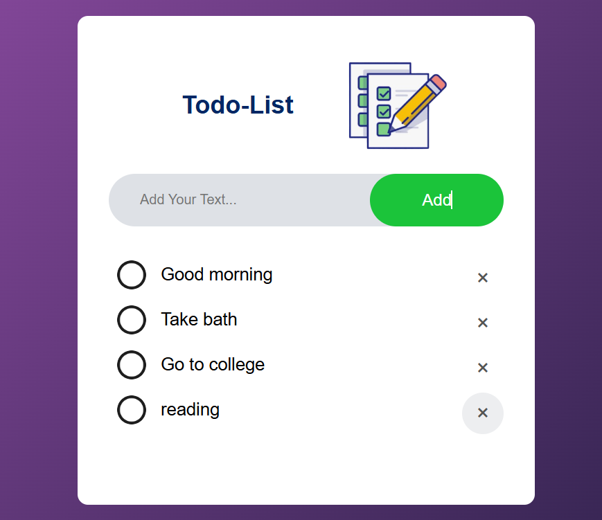

# Todo-List Web Application

## Overview

The Todo-List is a simple web application designed to help users manage their daily tasks efficiently. It allows users to add, edit, mark as completed, and delete tasks, ensuring a streamlined task management experience.

## Results


## Features

- **Add New Tasks:** Easily add tasks to your to-do list.
- **Mark Tasks as Completed:** Toggle tasks between completed and pending states.
- **Delete Tasks:** Remove tasks from your list when they're no longer needed.
- **Data Persistence:** Tasks are saved in the browser's local storage, ensuring they persist across sessions.

## Technologies Used

- **HTML:** Structure of the web pages.
- **CSS:** Styling and layout of the application.
- **JavaScript:** Functionality for adding, completing, and deleting tasks, as well as data storage.

## Installation

To set up the Todo-List application locally:

1. **Clone the Repository:**

   ```bash
   git clone https://github.com/Ank-25/Todo-List.git

   cd Todo-List
   ```
2. **Open `index.html` in Your Browser:**

- Simply double-click `index.html` or open it through your browser's "Open File" option.

## Usage

1. **Adding a Task:**

- Enter your task in the input box at the top of the page.
- Click the "Add" button to add the task to your list.

2. **Marking a Task as Completed:**

- Click on a task to toggle its completion status.Completed tasks will have a strikethrough and a different background color.

3. **Deleting a Task:**

- Click the "×" button next to a task to remove it from your list.

